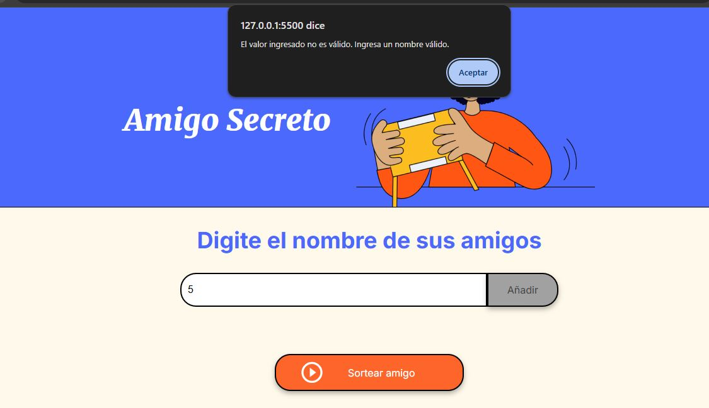
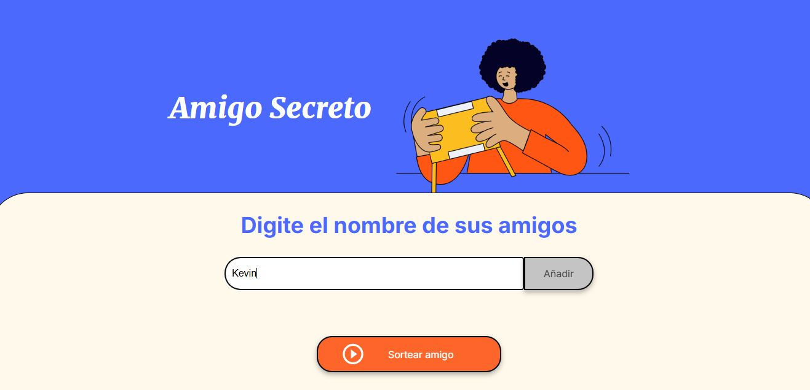
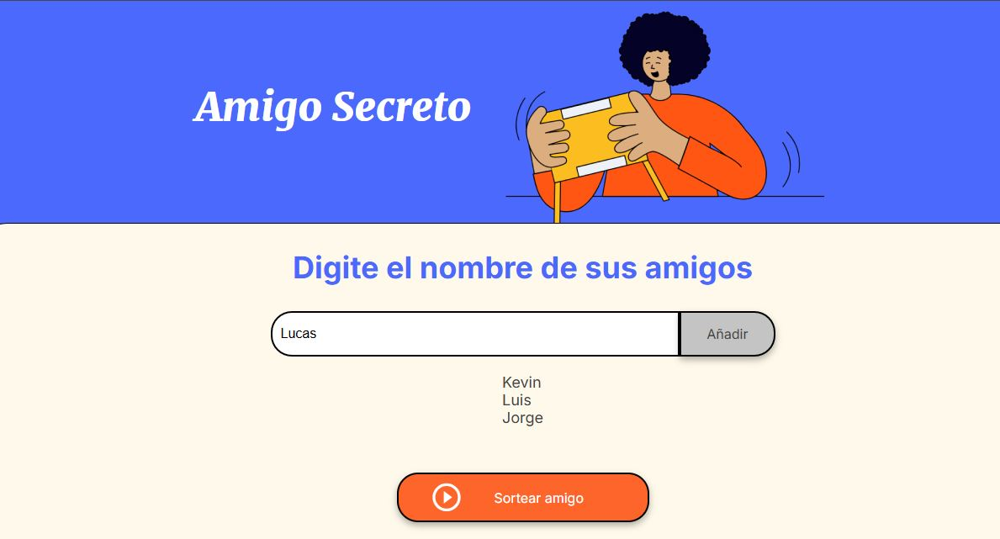
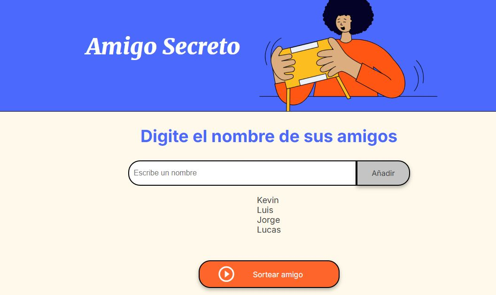
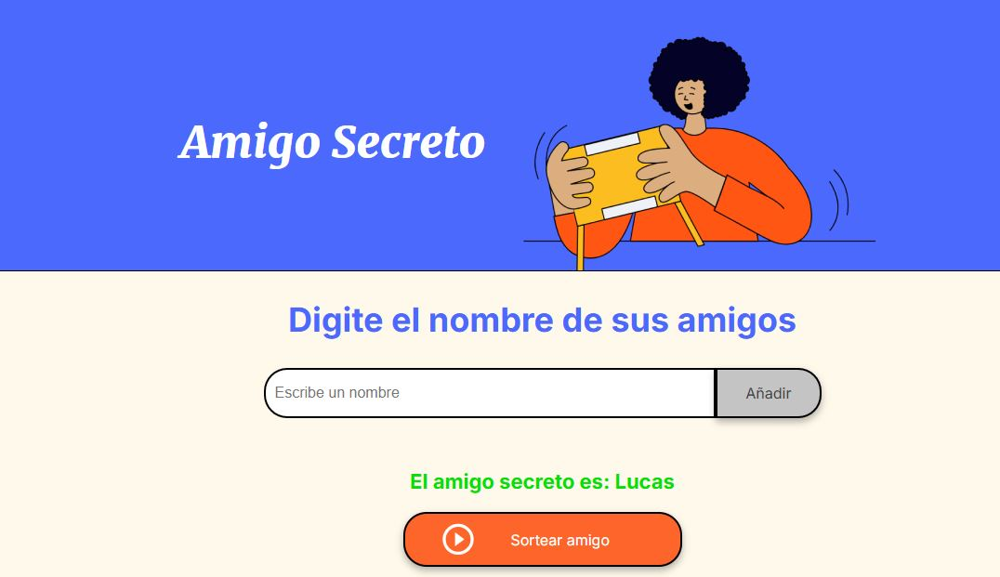
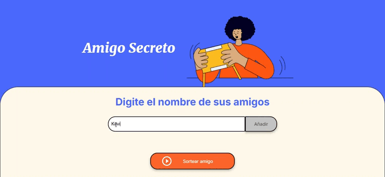

# Proyecto: Sorteo de Amigo Secreto

## Descripción

Este proyecto es una aplicación web simple que permite agregar nombres de amigos y realizar un sorteo de "Amigo Secreto". Se limita a un máximo de 10 participantes y valida los nombres ingresados para evitar caracteres no permitidos.

## Tecnologías Utilizadas

- **HTML**: Para la estructura de la interfaz.
- **CSS**: Para los estilos visuales.
- **JavaScript**: Para la lógica de la aplicación.

## Funcionalidades

1. **Agregar Amigos**: Se pueden agregar nombres de amigos a la lista.
2. **Validación de Nombres**: Solo se permiten letras y espacios en los nombres.
3. **Límite de Amigos**: No se pueden ingresar más de 10 amigos.
4. **Sorteo Aleatorio**: Se elige un amigo secreto de la lista de manera aleatoria.
5. **Reinicio del Sistema**: Permite limpiar la lista de amigos y reiniciar la interfaz.

## Instrucciones de Uso

1. Ingresar un nombre en el campo de entrada y presionar el botón "Agregar Amigo".
2. Una vez ingresados los participantes, presionar "Sortear" para elegir un amigo secreto.
3. Si se desea reiniciar el sistema, presionar el botón "Reiniciar".

## Estructura del Código

### Validación de Nombres

```javascript
function validarNombre(nombre) {
    for (let i = 0; i < nombre.length; i++) {
        let char = nombre.charAt(i);
        if (!((char >= 'A' && char <= 'Z') || (char >= 'a' && char <= 'z') || char === ' ')) {
            return false;  // Si hay un carácter no válido, devuelve false
        }
    }
    return true;  // Si todos los caracteres son válidos, devuelve true
}
```
Esta función recorre el nombre ingresado y verifica si solo contiene letras y espacios. Si encuentra algún carácter no permitido, devuelve `false`.

### Agregar un Amigo

```javascript
function agregarAmigo() {
    let nombre = digitarAmigo.value.trim(); // Elimina espacios al inicio y final
    
    if (!validarNombre(nombre)) {
        alert("El valor ingresado no es válido. Ingresa un nombre válido.");
        return;
    }
    
    if (amigos.length >= LIMITE_AMIGOS) {
        alert("Se ha sobrepasado el límite de 10 nombres. Se reiniciará el sistema.");
        reiniciarSistema();
        return;
    }
    
    amigos.push(nombre);
    digitarAmigo.value = "";
    resultado.innerHTML = "";
    actualizarLista();
}
```
Esta función agrega un amigo a la lista validando su nombre y asegurándose de no superar el límite de 10 amigos. En caso de que el límite sea excedido, se reinicia el sistema.

### Sorteo de Amigo Secreto

```javascript
function sortearAmigo() {
    if (amigos.length === 0) {
        alert("Debe agregar al menos un amigo antes de sortear.");
        return;
    }
    
    let indiceAleatorio = Math.floor(Math.random() * amigos.length);
    let amigoSecreto = amigos[indiceAleatorio];
    asignarTextoElemento("#resultado", "El amigo secreto es: <strong>" + amigoSecreto + "</strong>");
    
    listaAmigos.innerHTML = "";
    amigos = [];
}
```
Esta función selecciona un amigo de la lista de manera aleatoria y lo muestra en pantalla. Luego, borra la lista de amigos para evitar repeticiones.

### Reinicio del Sistema

```javascript
function reiniciarSistema() {
    amigos = [];
    listaAmigos.innerHTML = "";
    resultado.innerHTML = "";
    digitarAmigo.value = "";
}
```
Permite limpiar la lista de amigos y restablecer la interfaz para iniciar un nuevo sorteo.

## Capturas de Pantalla

### Paso 1: Verificación de entrada válida


### Paso 2: Ingresar nombres de amigos


### Paso 3: Lista de amigos agregados


### Paso 4: Realizar el sorteo


### Paso 5: Mostrar el resultado del sorteo


## Demostración en Video

Si deseas ver la aplicación en funcionamiento, puedes acceder al siguiente gif:



## Autor

Desarrollado por : **Kevin Palomino Villegas**

